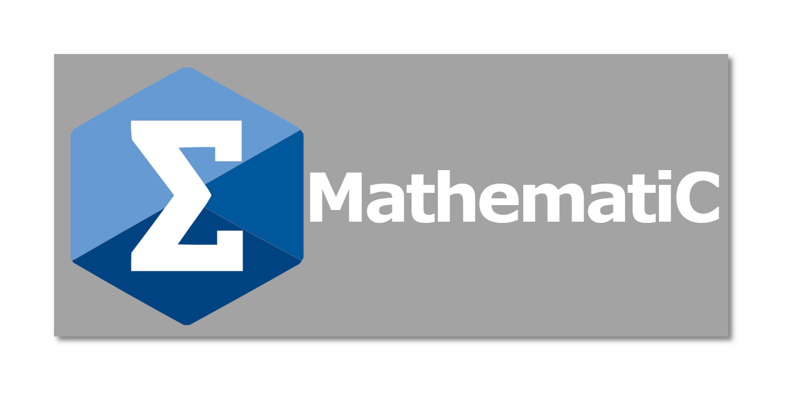

# MathematiC



A small function visualizer langage to be able to quickly draw a Mathematical funtion.
In order to learn how to use it, check the [Manual](doc/MANUAL.md).

# Libraries used
- make
- flex/bison
- SDL2 & OpenGL3
- [imgui](https://github.com/ocornut/imgui)

# Interface


# Code examples

```
var a = 1;
var b = 2;
var c = 3;

def function1: (x) => {
    return a*x^2 + b*x + b;
}

draw function1 in [-8,8] {
    color: [ "red" ],
    label: "Fonction 1"
}
```

```
def f: (x) => {

    return cos(x);
}

def g: (x) => {

    return sin(x);
}

draw f, g {
    color: [ "green", "blue" ],
    ymin: 0,
    ymax: 4
}
```

```
def sg: (t) => {
    if (t < 0) {
        return -1;
    } else {
        return 1;
    }
}

draw sg in [-1,1];
```

# Documentation

As mentionned before, the manual for the language is available in [doc/MANUAL.md](https://github.com/HugoMartel/Projet_ThL/blob/main/doc/MANUAL.md).
Examples can also be found in the `doc/examples/` folder.

Documentation for the source code has been generated with [Doxygen](https://www.doxygen.nl/index.html) and is available at `doc/html/index.html`.

# Compile

**Use commands in the root folder of the cloned repo**
*Compilation tested on PopOS! 21, Ubuntu 21, Archlinux & Fedora 35*
*Compiles on Windows 11 with WSL2 but has some strange behaviour with CTRL shortcuts...*

*Main Program:*
```
make all
./MathematiC
```

*Unit Testing:*
```
make unit_test
```

*Generate Documentation for the source code:*
```
doxygen && cp -rv img doc/html/
```
