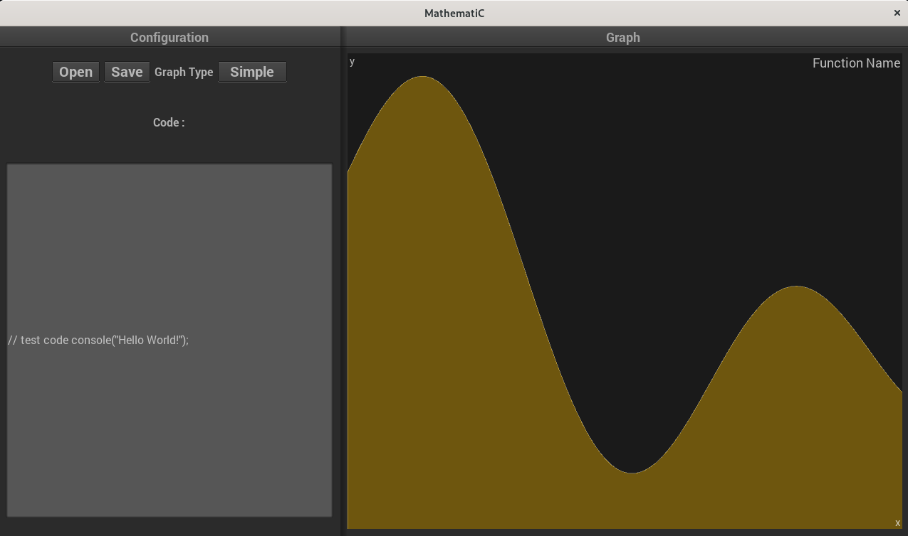

# Rapport de Projet
---
## Sommaire
1. [Introduction](#i-introduction)
2. [Outils Utilisés](#ii-outils-utilisés)
3. [Participations des membres](#iii-participations)
4. [Bilan](#iv-bilan)
---
## I. Introduction
Le sujet traité fut la creation d'un outil, qui au travers d'un "mini" langage permet de tracer et visualiser des graphes de fonctions mathématiques, projet que nous avons nommé MathematiC.   
 *L'interface du programme*

## II. Outils utilisés
Comme vu au long du cours de Théorie des langages, nous avons utilisés le C et C++ comme base du projet, en programmant la partie "langage" en flex/bison (sans utiliser de racourcis comme le javascript). Afin de coder la partie graphique nous avons utilisé SDL2 et openGL3, le tout à l'aide du framework [Dear ImGui](https://github.com/ocornut/imgui).
En plus de ce framework et de ces langages, nous avons bien évidemment utilisé git ainsi que github pour gérer le versioning, ainsi que Make pour compiler notre projet (on ne citera pas les éditeurs de texte tel vim utilisé par l'équipe pour programmer). Il est important de noter que nous avons aussi utilisé le framework [catch2.hpp](https://github.com/catchorg/Catch2) afin de réaliser des tests unitaires. Il faut aussi noter que l'on a utilisé les issues de github afin de remonter les erreurs aux personnes capable de les regarder comme sur cette [issue](https://github.com/HugoMartel/Projet_ThL/issues/1), ou [celle-ci](https://github.com/HugoMartel/Projet_ThL/issues/2). Enfin nous avons utilisé [Doxygen](https://www.doxygen.nl/index.html) afin de réaliser la documentation des diverses fonctions de notre projet.  
## III. Participations des membres
[Louis Ducrocq](https://github.com/Louis-duc) et [Lionel Smets](https://github.com/LionelSts) commencèrent par travailler sur la partie langage, en posant les fondements du flex et du bison pendant que [Louis Manouvriez](https://github.com/Spac3Drunk) et [Théodore Martin](https://github.com/TT-txt) commencèrent la partie front-end du projet en codant uniquement sur SDL2 sans framework, alors que [Hugo Martel](https://github.com/HugoMartel) travaillait sur le makefile.   Après une semaine et une prise de conscience, nous avons commencé à utiliser un framework pour la partie front-end: nous avons donc commené à écrire le front à l'aide du framework [nano-gui SDL](https://github.com/dalerank/nanogui-sdl). Hugo commença alors à travailler sur le front, mais après plusieurs semaines de travail sur ce framework nous avons découvert Dear Imgui, et avons décidé de changer pour utiliser celui-ci qui nous permettait de régler un grand nombre de problème (des inputs de textes multilines qui n'étaient pas programmés, etc..). Alors que Louis D et Lionel travaillait encore sur le langage, Hugo aida Louis M et Théodore à reprogrammer la Makefile (le changement de framework obligea de passer d'une compilation avec CMake à une compilation avec Make). Une fois que le projet recompila, Louis D créa alors les fonctions nécessaires pour l'affichage des courbes et leurs personalisations, pendant que Théodore programma l'affichage de la fenètre, les fonctions pour ouvrir et enregistrer un fichier, etc...  Une fois à la fin du projet, il y a eu une semaine de mise en commun ou toutes les branches du git ont été merges pour faire le lien entre toutes les parties, afin d'obtenir le projet final. Cette dernière phase entraine aussi une partie debug, réalisé à l'aide de tests unitaire et du framework cité dans [la partie II](#ii-outils-utilisés).  
## IV. Bilan
Ce projet ne fut clairement pas le plus simple que nous ayons eu à mener. Les problèmes se sont enchainés (comme avec le changement de framework), des segmentation fault et bien d'autres. Il fut aussi particulièrement intense: nous avons fait face une période de crunch sur les deux dernières semaines du projet pour tout terminer et tout debugger afin de rendre le projet en temps et en heure. Celui-ci nous a permit d'expérimenter avec de nouveau framework de C/C++, ainsi qu'une première expérience avec un framework de test unitaire. Ce projet nous a aussi permit de consolider nos acquis avec [Doxygen](https://www.doxygen.nl/index.html) pour générer la documentation de notre projet. Enfin il nous a aussi permit d'appliquer concrétement ce que nous avions appris lors des cours de théorie des langages, montrant alors toute son importance.